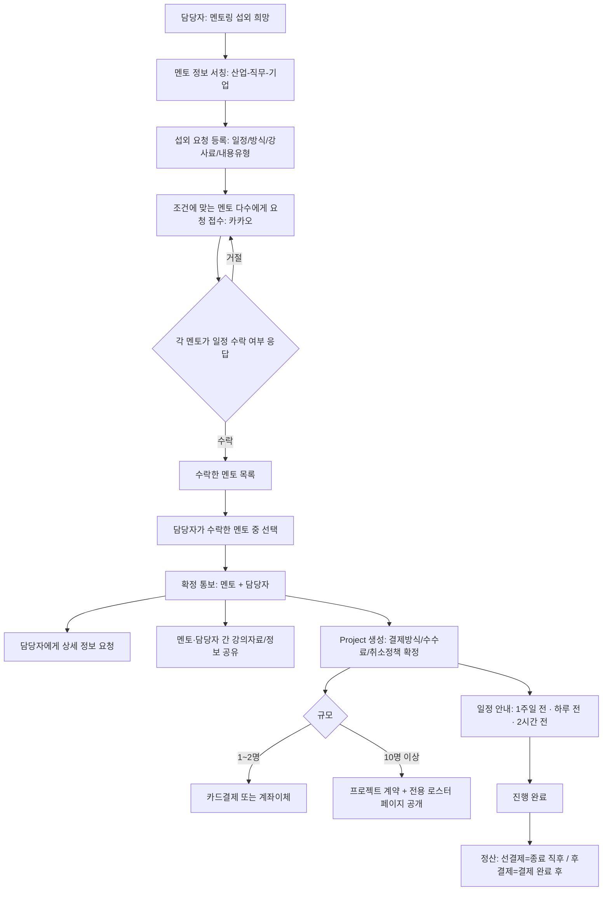

# 멘토링 플랫폼 서비스 기획서 (v2)

작성일: 2026-07-16

## 1. 서비스 개요

두 개의 서비스 라인으로 구성됩니다. 과금 체계와 참여 방식이 서로 다릅니다.

- **A. 멘토 추천/섭외 서비스**: 학교·기관 담당자가 조건에 맞는 멘토(들)를 섭외 요청 → 멘토들이 일정을 수락 → 담당자가 그중 선택 → 확정 → 강의/멘토링 진행. 기본 선결제, 강사료의 20% 수수료.
- **B. 멘토 질문(Q&A) 서비스**: 학생이 멘토에게 직접 질문하거나, 산업/직무/기업 단위로 다수 멘토에게 동시 질문. 학생 개인 크레딧(3건 무료 후 유료) 또는 학교/기관 구독(무제한) 방식.

**핵심 가치**
- 재직 여부가 검증된 신뢰할 수 있는 멘토
- 카카오톡 기반의 간편한 알림·승인·소통
- 매칭·구독 확정 시 자동으로 생성되는 프로젝트 전용 진행 관리 공간

> ⚠️ 확인 필요: 계약 파기(취소) 규정은 "온라인" 강의 기준(3일 전 무료 취소 / 하루 전 50% / 당일 100%)만 전달받았습니다. 오프라인 강의의 취소 규정은 아직 정해지지 않아 별도 확인이 필요합니다.

## 2. 사용자 역할

| 역할 | 설명 | 주요 행동 |
|---|---|---|
| 멘토 | 재직 중인 전문가, 재직 인증을 통과해야 노출됨 | 프로필 등록, 재직 인증 서류 제출, 섭외 요청에 일정 수락/거절(카카오톡), 질문 확인/답변(카카오톡), 진행 기록 작성, 본인 참여 횟수·정산 금액 확인 |
| 담당자 | 학교·기관 소속, 멘토를 찾는 주체 | 멘토 검색, 섭외 요청 생성, 수락한 멘토 중 선택, 프로젝트 룸 일정 확인, 소속 학생 참여 승인, 학생별 참여 결과·질문 건수 확인(금액은 비공개) |
| 학생 | 학교 코드로 가입하는 실제 참여자 (대학생 기준) | 학교 코드 입력 후 가입, 멘토에게 질문(1:1 또는 다수 브로드�스트), 본인 질문/답변만 조회, 무료/유료 질문 크레딧 사용 |
| 관리자 | 플랫폼 운영자(운영기관) | 멘토 승인, 재직 인증 검토, 섭외·프로젝트·결제 전체 현황 관리, 학교 코드 발급, 멘토 정산·질문 채택 보상 금액 관리, 운영 관제 대시보드 |

## 3. 멘토 추천 서비스 — 전체 흐름



## 4. 멘토 추천 서비스 — 기능 상세

### 4.1 섭외 요청 (담당자)
- 담당자가 산업 / 직무 / 기업으로 멘토 정보를 서칭
- 섭외 요청 등록 항목: 희망 일정, 진행 방식(온라인/오프라인), 제안 강사료, 내용 유형(단순 멘토링 / 직무 교육 / 실습 / 특강 등)
- 조건에 맞는 멘토 **다수**에게 동시에 요청이 전달됨 (1명 지정이 아님)

### 4.2 멘토 응답 및 선택
- 요청을 받은 각 멘토는 카카오 알림톡의 웹 액션 링크에서 **일정 수락/거절**로 응답
- 담당자는 수락한 멘토 목록 중에서 최종 인원을 선택
- 선택 결과는 멘토·담당자 양쪽에 확정 통보(카카오 알림톡)

### 4.3 확정 후 처리
- 담당자에게 상세 정보(강의 장소, 대상 인원, 세부 요청사항 등) 추가 요청
- 계약 파기(취소) 정책 적용: 온라인 기준 3일 전 취소는 위약금 없음, 하루 전 취소는 강사료의 50%, 당일 취소는 100% 지급
- 멘토 프로필·강의자료를 담당자와 공유, 담당자가 제공한 자료도 멘토와 공유

### 4.4 일정 안내
- 확정된 일정에 대해 **1주일 전 / 하루 전 / 2시간 전** 카카오 알림톡 자동 발송 (멘토·학생 대상)

### 4.5 결제·정산 정책
- 서비스 기본 결제 방식은 **선결제**, 멘토 강사료의 **20% 수수료** 부과
- 1~2명 섭외: 카드 결제 또는 계좌이체로 간편 처리
- 10명 이상 섭외: 정식 프로젝트 계약으로 전환, **직영 운영 체계**로 진행하며 확정된 멘토 정보가 노출되는 **전용 로스터 페이지**(홈페이지형)를 자동 생성
- 정산 시점: 선결제 프로젝트는 종료 직후, 후결제 프로젝트는 기관 결제 완료 후 (§4.9 데이터 모델의 `Invoice`/`MentorSettlement` 참조)

## 5. 멘토 질문(Q&A) 서비스 — 전체 흐름

```mermaid
flowchart TD
    A[학생: 질문 작성 시도] --> B{유사 질문의 기존 답변 존재?}
    B -->|있음| C[기존 답변 먼저 제시]
    C --> D{추가 질문 필요?}
    D -->|아니오| Z[종료]
    D -->|예| E
    B -->|없음| E[질문 방식 선택]
    E --> E1[멘토 개인에게 직접 질문]
    E --> E2[산업 포함 멘토 다수에게 질문]
    E --> E3[직무 포함 멘토 다수에게 질문]
    E --> E4[기업 포함 멘토 다수에게 질문]
    E1 --> F{크레딧/구독 확인}
    E2 --> F
    E3 --> F
    E4 --> F
    F -->|학교/기관 구독 중| G[무제한 무료 진행]
    F -->|미구독: 무료 3건 이내| G
    F -->|미구독: 무료 소진| H[5건 1만원 결제]
    H --> G
    G --> I[대상 멘토(들)에게 카카오 알림톡 발송]
    I --> J{직접 질문 or 다수 질문}
    J -->|직접| K[멘토가 웹에서 답변]
    K --> L[학생에게 카카오 알림톡: 답변 도착]
    J -->|다수| M[여러 멘토가 각자 답변]
    M --> N[학생이 답변 채택]
    N --> O[채택된 멘토에게만 보상 지급]
    K --> P{24시간 내 미답변?}
    P -->|예| Q[운영 관제: 지연 경고]
    M --> R{특정 멘토 3회 이상 무응답?}
    R -->|예| Q
```

## 6. 멘토 질문(Q&A) 서비스 — 기능 상세

### 6.1 이용 자격 및 과금
- 학생 개인: **3건까지 무료**, 이후 **5건 1만원** 단위로 크레딧 구매 (다양한 구독 요금제는 2차 확장에서 검토)
- 학교/기관이 Q&A 서비스에 **구독 신청**(학교 코드 부여)한 경우, 해당 학교·기관 소속 참여자는 크레딧 소모 없이 자유롭게 이용

### 6.2 질문 방식 (4종)
1. 멘토 개인에게 직접 질문 (1:1)
2. 해당 **산업**을 포함하는 멘토 다수에게 질문
3. 해당 **직무**를 포함하는 멘토 다수에게 질문
4. 해당 **기업**을 포함하는 멘토 다수에게 질문
- 질문 작성 전, 유사한 기존 질문에 이미 등록된 답변이 있으면 먼저 제시하고, 그래도 필요하면 새 질문으로 등록

### 6.3 질문 접수 및 처리
- 대상 멘토(1명 또는 다수)에게 카카오 알림톡으로 질문 접수 → 답변 → 학생에게 카카오 알림톡으로 답변 도착 안내
- 산업/직무/기업 단위로 다수 멘토에게 보낸 경우, 학생이 여러 답변 중 하나를 **채택**할 수 있으며, 채택된 답변을 작성한 멘토에게만 보상이 지급됨
- 지연 경고 기준
  - **직접 질문(1:1)**: 24시간 내 미답변 시 경고
  - **다수 질문(브로드캐스트)**: 특정 멘토가 누적 **3회 이상 무응답**일 경우 해당 멘토에게 경고(신뢰도 플래그)

### 6.4 프로젝트 추가 시 참여 확인
- 학교/프로젝트 단위로 Q&A 참여(구독)가 추가되면, 전용 페이지와 기능이 함께 연동됨
- 멘토는 추가된 프로젝트에 대해 **참여 여부를 체크**해야 하며, 체크한 경우에만 해당 프로젝트발 질문을 받고 프로젝트 페이지에도 노출됨

### 6.5 확인 및 정산
- 프로젝트별 질문/답변 비용 정산 카운트와 금액은 **멘토 본인과 운영기관(관리자)만** 확인 가능
- 학교·기관 담당자는 금액이 아닌 **질문 건수 내역**만 확인 가능

## 7. 공통 기능

### 7.1 카카오톡 연동 (방식 A: 알림톡 + 웹 액션 링크)
- 대상 이벤트: 섭외 요청 도착(멘토), 확정 통보(멘토·담당자), 일정 안내(1주일전·하루전·2시간전), 신규 질문(멘토), 답변 완료(학생), 재직 인증 결과(멘토), 프로젝트 추가 참여 확인(멘토)
- 알림톡의 "수락/거절/답변하기/확인하기" 버튼 → 1회성 웹 액션 페이지로 연결되어 그 자리에서 처리
- 카카오 비즈니스 채널 + 발신프로필 등록, 메시지 템플릿 사전 심사 필요
- 발송은 외부 알림톡 대행 API(솔라피, 알리고 등) 사용, 건당 비용 발생

### 7.2 프로젝트 자동 생성 & 진행 관리
- 멘토 추천 확정 또는 Q&A 구독 신청 시, 별도 사이트를 새로 배포하지 않고 하나의 시스템 안에서 프로젝트 전용 공간을 자동 생성(멀티테넌트 구조)
- 10명 이상 규모의 섭외 프로젝트는 확정된 멘토 정보가 공개되는 **전용 로스터 페이지**로 전환
- 기능: 일정(회차) 관리, 회차별 진행 기록, 보고서 작성/제출, 강의자료 공유

### 7.3 멘토 재직 인증 (방식 1: 서류 업로드 + 관리자 승인)
- 멘토가 정부24에서 발급받은 건강보험자격득실확인서를 업로드
- 관리자가 검토 후 승인/반려, 결과는 카카오 알림톡으로 통보
- (2차 확장) CODEF 등 데이터 스크래핑 API를 통한 자동 조회

### 7.4 학생 참여 관리 (학교 코드 기반)
- 관리자가 학교/기관마다 고유한 학교 코드(`org_code`)를 발급
- 학생 회원가입 정보: 이름, 연락처, 학교(학교 코드로 자동 연결), 전공, 학번, 성별, 관심분야
- 담당자가 참여 신청을 승인/반려, 승인된 학생만 프로젝트에 연결

### 7.5 학교(담당자) 참여 현황 대시보드
- 구분 보기: 전체 / 분야별 / 직무별 / 기업별 / 개인별
- 기간 보기: 이번 주 / 이번 달 / 전체, 전체 리스트 CSV 다운로드
- 담당자에게는 금액 대신 참여·질문 **건수**만 노출 (§6.5 참조)

### 7.6 운영 관제 대시보드 (관리자, 실시간)
1. 섭외 요청 접수 현황 (요청 → 수락 → 확정 단계별 실시간 집계, 성사율)
2. 추천 멘토 없음 경고 — 조건에 맞는 멘토가 없거나 응답이 없을 때
3. 확정 프로젝트 스케줄표 + 사전 알림 발송 현황(1주일전/하루전/2시간전)
4. 결제 현황 — 선결제/후결제, 카드/계좌이체/프로젝트 계약 여부, 정산 가능 상태
5. 질문 접수·매칭 현황 실시간 확인 (직접/브로드캐스트, 채택 여부)
6. 질문 지체 경고 — 직접 질문 24시간 초과 / 브로드캐스트 멘토 3회 이상 무응답

## 8. 데이터 모델

### 8.1 계정 · 기관

| 테이블 | 주요 필드 | 설명 |
|---|---|---|
| `User` | id, email, phone, role, name | 공통 계정. role: mentor / coordinator / student / admin |
| `Organization` | id, name, type, address, org_code, qna_subscription_status | org_code는 학교 코드, qna_subscription_status는 Q&A 구독 여부 |
| `MentorProfile` | id, user_id, company, department, position, job_function, industry, main_duties, mentoring_fields, bio, available_times, region, status, avg_rating, no_response_count | job_function(직무)·industry(산업)는 섭외 검색·브로드캐스트 질문의 필터 기준. no_response_count는 브로드캐스트 질문 무응답 누적 |
| `MentorCareer` | id, mentor_id, start_year, end_year, organization, description | 주요 경력 사항 (복수) |
| `MentorEducation` | id, mentor_id, degree_type, school_name, major, graduation_year | 출신 학교 (학사/석사) |
| `VerificationDocument` | id, mentor_id, file_url, status, reviewed_by, reviewed_at | 재직 인증 서류 |
| `StudentProfile` | id, user_id, student_no, major, gender, interest_fields, free_questions_used | free_questions_used로 무료 3건 소진 여부 판단 |

### 8.2 섭외·매칭·프로젝트

| 테이블 | 주요 필드 | 설명 |
|---|---|---|
| `MatchRequest` | id, org_id, requested_by, industry, job_function, company_filter, requested_schedule, format, proposed_fee, content_type, status, created_at | 담당자의 섭외 요청 1건. status: recruiting/mentor_selected/confirmed/cancelled |
| `MatchCandidate` | id, match_request_id, mentor_id, status, responded_at | 요청 대상 멘토별 응답. status: invited/accepted/declined/selected/not_selected |
| `Project` | id, match_request_id, org_id, type, scale_tier, commission_rate, payment_type, payment_method, session_fee, project_code, detail_info, status, cancelled_at, cancellation_fee_rate, created_at | type: recommendation/qna_subscription. scale_tier: individual(1~2명)/managed(10명+, 로스터 페이지 공개) |
| `ProjectMember` | id, project_id, user_id, role_in_project | 프로젝트 참여자(멘토 다수 가능/담당자) |
| `LectureMaterial` | id, project_id, uploaded_by, file_url, title, created_at | 멘토·담당자 간 공유 자료 |
| `ProjectSchedule` | id, project_id, session_no, scheduled_at, topic, status, attended, reminder_7d_sent, reminder_1d_sent, reminder_2h_sent | 회차별 일정 및 알림 발송 플래그 |
| `ProgressLog` | id, schedule_id, content, attachments, created_by, created_at | 회차별 진행 기록 |
| `Report` | id, project_id, title, content, submitted_by, submitted_at, status | 보고서 |
| `StudentEnrollment` | id, project_id, student_id, org_code, status, approved_by, approved_at, result_summary | 학교 코드로 신청한 학생의 승인 상태 · 참여 결과 |

### 8.3 질문(Q&A) · 정산 · 결제

| 테이블 | 주요 필드 | 설명 |
|---|---|---|
| `Question` | id, student_id, project_id, scope_type, scope_value, content, created_at, status | scope_type: individual/industry/job_function/company |
| `QuestionTarget` | id, question_id, mentor_id, notified_at, responded_at | 브로드캐스트 시 질문이 전달된 멘토별 레코드 |
| `Answer` | id, question_id, mentor_id, content, created_at, is_accepted, accepted_at | is_accepted: 다수 답변 중 채택 여부 |
| `AnswerReward` | id, answer_id, mentor_id, amount, status | 채택된 답변에 대한 보상. status: 정산대기/정산완료 |
| `QuestionCreditPurchase` | id, student_id, credits_purchased, amount, purchased_at | 무료 3건 소진 후 5건 1만원 결제 내역 |
| `MentorSettlement` | id, mentor_id, project_id, period_start, period_end, session_count, total_amount, status, paid_at | status: 정산대기/정산가능/정산완료 |
| `Invoice` | id, project_id, org_id, payment_type, payment_method, amount, status, invoiced_at, paid_at | 기관 대상 결제/청구. payment_method: 카드/계좌이체/프로젝트계약 |
| `OperationsAlert` | id, type, ref_table, ref_id, triggered_at, resolved_at, status | type: no_mentor_match / question_delay / mentor_no_response |
| `KakaoNotification` | id, user_id, type, template_code, sent_at, status, action_token | type: match_request/candidate_accept/final_confirm/schedule_reminder/new_question/answer_ready/verification_result/project_addition_confirm |

## 9. 화면 목록

**공통**: 로그인/회원가입(역할 선택), 마이페이지

**멘토**: 대시보드, 프로필 관리(소속/경력/학력/직무/산업/멘토링영역), 재직 인증 서류 업로드, 섭외 요청함(일정 수락/거절), 확정 프로젝트 목록·룸(일정/기록/보고서/자료공유), 질문함(직접/브로드캐스트), 참여 횟수·정산·질문 보상 내역, 신규 프로젝트 참여 확인

**담당자**: 멘토 검색/필터(산업·직무·기업), 섭외 요청 등록, 수락한 멘토 중 선택, 매칭 현황, 프로젝트 룸, 학생 참여 승인, 학생별 참여 결과·질문 건수 조회(금액 비공개), 참여 현황 대시보드(CSV), Q&A 구독 신청

**학생**: 학교 코드 입력 후 참여 신청, 질문 작성(4가지 방식 + 유사 질문 우선 제시), 크레딧/구독 상태 확인, 크레딧 구매, 내 질문·답변 목록(본인 것만)

**관리자**: 멘토 승인, 재직 인증 검토, 섭외 요청·매칭 후보 전체 현황, 프로젝트 전체 목록(로스터 페이지 관리 포함), 학교 코드·Q&A 구독 관리, 멘토 정산·질문 채택 보상 관리, 결제/청구(Invoice) 관리, 운영 관제 대시보드, 카카오 알림 발송 로그

## 10. 기술 스택

- **Next.js** (App Router) — 프론트엔드 + API
- **Supabase** — 인증, PostgreSQL DB, 파일 스토리지
- **Tailwind CSS** — UI
- **Vercel** — 배포
- **카카오 알림톡 API** (대행사: 솔라피/알리고 등)
- **결제 대행(PG)** — 카드/계좌이체 처리용 (예: 토스페이먼츠, 아임포트 등 — 벤더 미정, 확인 필요)
- **Zod** — 폼/입력 검증

## 11. MVP 범위 / 2차 확장

**MVP (1차)**
- 역할별(멘토/담당자/학생/관리자) 회원가입/로그인
- 멘토 프로필(소속/경력/학력/직무/산업/멘토링영역) 등록·검색
- 섭외 요청 → 다수 멘토 응답 → 담당자 선택 → 확정 → 카카오 알림톡 전 구간
- 확정 후 상세정보 요청, 자료 공유, 취소 정책 적용
- 일정 안내(1주일전/하루전/2시간전) 카카오 알림
- 결제: 1~2명 카드/계좌이체, 10명 이상 프로젝트 계약 + 로스터 페이지
- 선결제/후결제에 따른 멘토 정산 시점 관리
- Q&A: 크레딧(3건 무료+구매) 또는 기관 구독, 4가지 질문 방식, 답변 채택·보상, 지연 경고
- 재직 인증 서류 업로드 + 관리자 승인
- 학교 코드 기반 학생 참여, 참여 현황 대시보드, 운영 관제 대시보드

**2차 확장**
- 보고서 정식 양식/PDF 출력, 멘토 평점/후기
- 카카오톡 채널 챗봇 전환(대화형 승인/답변)
- 재직 인증 자동 API 연동(CODEF 등)
- 유사 질문 검색의 정교화(임베딩 기반 추천)
- 다양한 Q&A 구독 요금제
- 정산 자동 지급(계좌이체 연동), 운영 통계 대시보드 고도화

## 12. 개발 로드맵

| Phase | 내용 |
|---|---|
| Phase 0 | 서비스 구조 설계 확정 (본 문서) |
| Phase 1 | 프로젝트 뼈대: 인증/역할별 대시보드, DB 스키마, 배포 파이프라인 |
| Phase 2 | 섭외/매칭 플로우: 멘토 프로필/검색, 섭외 요청~다수 응답~선택~확정, 카카오 알림톡 |
| Phase 3 | 프로젝트 관리 & 결제: 일정/사전알림, 자료공유, 취소정책, 결제(카드·계좌이체·PG), 정산 시점 관리 |
| Phase 4 | Q&A 서비스: 크레딧/구독, 4종 질문 방식, 답변 채택·보상, 지연 경고 |
| Phase 5 | 재직 인증 플로우 + 운영 관제 대시보드 + 전체 QA + 오픈 |
