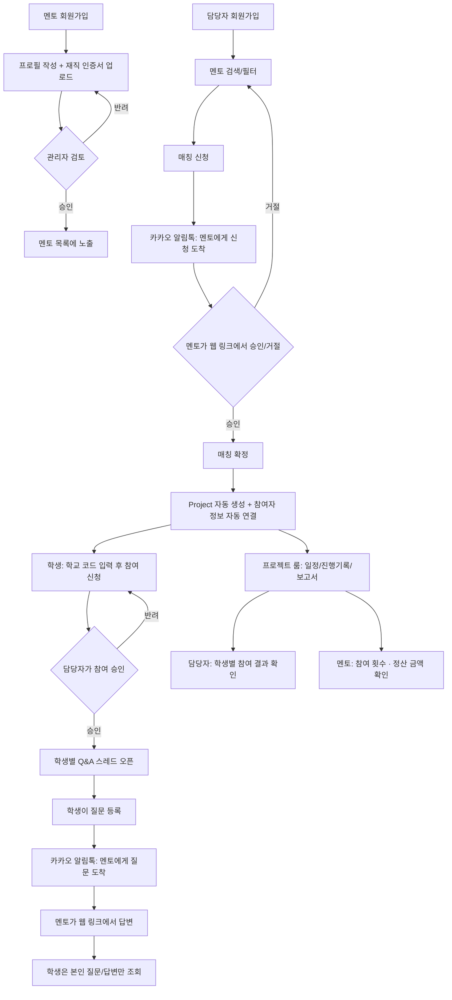

# 멘토링 플랫폼 서비스 기획서 (v1)

작성일: 2026-07-16

## 1. 서비스 개요

- **목적**: 학교·기관 담당자가 필요한 멘토를 찾아 매칭하고, 매칭 이후에도 멘토-담당자(멘티)가 지속적으로 소통하며 프로젝트를 진행할 수 있도록 지원하는 플랫폼
- **핵심 가치**
  - 재직 여부가 검증된 신뢰할 수 있는 멘토
  - 카카오톡 기반의 간편한 알림/승인/소통
  - 매칭 확정 시 자동으로 생성되는 프로젝트 전용 진행 관리 공간

## 2. 사용자 역할

| 역할 | 설명 | 주요 행동 |
|---|---|---|
| 멘토 | 재직 중인 전문가, 재직 인증을 통과해야 노출됨 | 프로필 등록, 재직 인증 서류 제출, 매칭 요청 승인/거절(카카오톡), 질문 확인/답변(카카오톡), 프로젝트 진행 기록 작성, 본인 참여 횟수·정산 금액 확인 |
| 담당자 | 학교·기관 소속, 멘토를 찾는 주체 | 멘토 검색, 매칭 신청, 프로젝트 룸에서 일정 확인, 소속 학생 참여 승인, 학생별 참여 결과 확인 |
| 학생 | 학교 코드로 가입하는 실제 멘토링 참여자 | 학교 코드 입력 후 가입 신청 → 담당자 승인 후 프로젝트 참여, 멘토에게 질문 등록, 본인이 질문한 내용과 답변만 조회 |
| 관리자 | 플랫폼 운영자 | 멘토 승인, 재직 인증 서류 검토, 매칭/프로젝트 전체 현황 관리, 학교 코드 발급/관리, 멘토 정산 관리, 카카오 알림 발송 로그 확인 |

## 3. 전체 흐름

## 4. 기능 상세

### 4.1 멘토 추천/매칭
- 담당자가 전문분야, 경력연차, 지역, 활동 가능 시간대로 멘토 검색
- 멘토 상세 프로필 열람, 프로필 구성 항목:
  1. 현재 소속: 기업 / 부서 / 직책(직급)
  2. 주요 경력 사항 (연도 포함, 복수 항목 가능)
  3. 출신 학교 (학사 + 석사)
  4. 주요 업무 내용
  5. 멘토링 영역
- 매칭 신청 → 카카오 알림톡 발송 → 멘토가 승인/거절 → 확정 시 Project 자동 생성

### 4.2 Q&A
- 매칭이 확정된 프로젝트 단위에서만 질문 가능
- 게시판형 스레드(질문 → 답변 → 후속 댓글), 실시간 채팅 아님
- 스레드는 **학생 단위로 분리**됨 — 학생은 본인이 작성한 질문과 그에 대한 답변만 조회 가능 (다른 학생의 질문 열람 불가)
- 새 질문/답변 발생 시 카카오 알림톡 발송

### 4.3 카카오톡 연동 (방식 A: 알림톡 + 웹 액션 링크)
- 대상 이벤트: 신규 매칭 요청, 신규 질문, 재직 인증 결과
- 알림톡 메시지에 "승인/거절/답변하기" 버튼 → 모바일 웹의 1회성 액션 페이지로 연결되어 그 자리에서 처리
- 카카오 비즈니스 채널 + 발신프로필 등록, 메시지 템플릿 사전 심사 필요
- 실제 발송은 외부 알림톡 대행 API(예: 솔라피, 알리고 등) 사용, 건당 발송 비용 발생

### 4.4 프로젝트 자동 생성 & 진행 관리
- 매칭 확정 시 별도 사이트를 새로 배포하지 않고, 하나의 시스템 안에서 프로젝트 전용 공간을 자동 생성(멀티테넌트 구조)
- 매칭 정보·참여자 정보(멘토, 담당자, 기관)가 자동으로 프로젝트에 연결됨
- 프로젝트 전용 URL 발급 (예: `/project/{project_code}`)
- 기능: 일정(회차) 관리, 회차별 진행 기록, 보고서 작성/제출

### 4.5 멘토 재직 인증 (방식 1: 서류 업로드 + 관리자 승인)
- 멘토가 정부24에서 발급받은 건강보험자격득실확인서를 업로드
- 관리자가 검토 후 승인/반려, 결과는 카카오 알림톡으로 통보
- (2차 확장 옵션) CODEF 등 데이터 스크래핑 API 연동을 통한 자동 조회 — 유료 계약 및 사용자 동의 절차 필요

### 4.6 학생 참여 관리 (학교 코드 기반)
- 관리자가 학교/기관마다 고유한 **학교 코드**(`org_code`)를 발급
- 학생은 회원가입 시 학교 코드를 입력해 소속 학교에 참여 신청
- 해당 학교 담당자가 참여 신청을 승인/반려 (담당자 화면에서 대기 목록 확인)
- 승인된 학생만 프로젝트에 연결되어 멘토에게 질문할 수 있음
- 담당자는 소속 학생별 참여 결과(참석 횟수, 진행 상태, 완료 여부)를 확인 가능

### 4.7 멘토 정산 관리
- 프로젝트별로 회당 정산 단가(`session_fee`)를 설정
- 멘토는 자신의 대시보드에서 회차별 참석 여부, 누적 참여 횟수, 정산 예정 금액을 확인 가능
- 관리자는 전체 멘토의 정산 현황을 확인하고 정산 완료 처리 가능 (실제 계좌 이체 등 지급 실행은 MVP 범위 밖 — 금액 확인/기록까지가 MVP)

## 5. 데이터 모델

| 테이블 | 주요 필드 | 설명 |
|---|---|---|
| `User` | id, email, phone, role, name, org_id | 공통 계정 (역할: mentor / coordinator / student / admin) |
| `Organization` | id, name, type, address, org_code | 학교·기관 정보. org_code는 학생 가입용 학교 코드 |
| `MentorProfile` | id, user_id, company, department, position, main_duties, mentoring_fields, bio, available_times, region, status, avg_rating | 멘토 상세 정보. mentoring_fields는 멘토링 영역(복수 태그), status는 pending/approved/rejected |
| `MentorCareer` | id, mentor_id, start_year, end_year, organization, description | 주요 경력 사항. 멘토 1명당 여러 건 등록 가능 |
| `MentorEducation` | id, mentor_id, degree_type, school_name, major, graduation_year | 출신 학교. degree_type: 학사/석사 (멘토 1명당 2건) |
| `VerificationDocument` | id, mentor_id, file_url, status, reviewed_by, reviewed_at | 재직 인증 서류 |
| `MatchRequest` | id, mentor_id, coordinator_id, org_id, message, status, requested_at, responded_at | 매칭 신청/승인/거절 |
| `Project` | id, match_request_id, mentor_id, coordinator_id, org_id, project_code, session_fee, status, created_at | 매칭 확정 시 자동 생성, session_fee는 회당 정산 단가 |
| `ProjectMember` | id, project_id, user_id, role_in_project | 프로젝트 참여자(멘토/담당자) |
| `StudentEnrollment` | id, project_id, student_id, org_code, status, approved_by, approved_at, result_summary | 학교 코드로 참여 신청한 학생의 승인 상태 및 참여 결과 |
| `ProjectSchedule` | id, project_id, session_no, scheduled_at, topic, status, attended | 회차별 일정, attended는 멘토 참석 여부(정산 근거) |
| `ProgressLog` | id, schedule_id, content, attachments, created_by, created_at | 회차별 진행 기록 |
| `Report` | id, project_id, title, content, submitted_by, submitted_at, status | 보고서 |
| `QAThread` | id, project_id, student_id, created_by, subject, created_at | 질문 스레드. student_id로 학생별 분리, 본인 스레드만 조회 가능 |
| `QAMessage` | id, thread_id, sender_id, content, created_at, read_at | 질문/답변 메시지 |
| `MentorSettlement` | id, mentor_id, project_id, period_start, period_end, session_count, total_amount, status, paid_at | 멘토 참여 횟수·정산 금액 집계, status는 정산대기/정산완료 |
| `KakaoNotification` | id, user_id, type, template_code, sent_at, status, action_token | 알림톡 발송 로그 및 1회성 액션 토큰 |

## 6. 화면 목록

**공통**: 로그인/회원가입(역할 선택), 마이페이지

**멘토**: 대시보드, 프로필 관리, 재직 인증 서류 업로드, 매칭 요청함, 진행중 프로젝트 목록, 프로젝트 룸(일정/기록/보고서), Q&A, **내 참여 횟수·정산 내역**

**담당자**: 멘토 검색/필터, 멘토 상세 프로필, 매칭 신청, 매칭 현황, 프로젝트 룸, Q&A, **학생 참여 승인 대기 목록**, **학생별 참여 결과 조회**

**학생**: 학교 코드 입력 후 참여 신청, 참여 승인 대기/현황, **내 질문·답변 목록(본인 스레드만)**, 질문 등록

**관리자**: 멘토 승인 대기 목록, 재직 인증 검토, 매칭 전체 현황, 프로젝트 전체 목록, 카카오 알림 발송 로그, **학교 코드 발급/관리**, **멘토 정산 관리**

## 7. 기술 스택

- **Next.js** (App Router) — 프론트엔드 + API
- **Supabase** — 인증, PostgreSQL DB, 파일 스토리지(인증 서류 업로드)
- **Tailwind CSS** — UI
- **Vercel** — 배포
- **카카오 알림톡 API** (대행사: 솔라피/알리고 등) — 알림/승인/거절/답변 연동
- **Zod** — 폼/입력 검증

## 8. MVP 범위 / 2차 확장

**MVP (1차)**
- 역할별(멘토/담당자/학생/관리자) 회원가입/로그인
- 멘토 프로필 등록·검색·상세
- 매칭 신청 → 카카오 알림톡 승인/거절 → 확정
- 프로젝트 자동 생성 + 일정/진행기록 기본 CRUD
- 학교 코드 기반 학생 참여 신청 → 담당자 승인
- Q&A 게시판형 스레드(학생별 분리) + 카카오 알림톡
- 재직 인증 서류 업로드 + 관리자 승인
- 멘토 참여 횟수·정산 금액 확인, 담당자용 학생 참여 결과 확인, 관리자용 정산/학교코드 관리 화면

**2차 확장**
- 보고서 정식 양식/PDF 출력
- 멘토 평점/후기
- 카카오톡 채널 챗봇으로 전환(대화형 승인/답변)
- 재직 인증 자동 API 연동(CODEF 등)
- 운영 통계 대시보드
- 정산 자동 지급(계좌이체 연동)

## 9. 개발 로드맵

| Phase | 내용 |
|---|---|
| Phase 0 | 서비스 구조 설계 확정 (본 문서) |
| Phase 1 | 프로젝트 뼈대: 인증/역할별 대시보드, DB 스키마, 배포 파이프라인 |
| Phase 2 | 매칭 플로우: 멘토 프로필/검색, 매칭 신청~확정, 카카오 알림톡 연동 |
| Phase 3 | 프로젝트 & Q&A: 프로젝트 자동 생성, 일정/진행기록, Q&A 스레드 |
| Phase 4 | 재직 인증 플로우 + 전체 QA + 오픈 |
